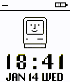
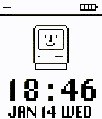

# HappyMac

A Pebble watchface inspired by the classic Happy Mac, with Light, Dark, and Color themes.

Wish you happy :)

Check in pebble app store. Currently it supports all the pebbles (e.g. `aplite`, `chalk`, `diorite`, `emery`, `flint`).

Take a look at different themes.


On Black and white devices it also works well.



## Build

```bash
pebble build
```

## Install

```bash
pebble install --emulator basalt build/HappyMac.pbw
```

Replace `basalt` with your target platform (e.g. `aplite`, `chalk`, `diorite`, `emery`, `flint`).

## Theme settings

Open the watchface settings from the Pebble mobile app, choose Light/Dark/Color, and tap Save.

## Files

- `src/c/HappyMac.c`: watchface implementation
- `src/pkjs/index.js`: settings page (Clay)
